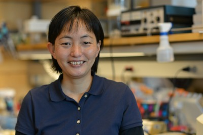

masako.asahina@ucsf.edu

Multicellular organisms have intriguing capabilities to respond to environmental and physiological cues, transduce the signal as tissue-specific or cell-context dependent information and mobilize gene activities to be flexible to keep homeostasis. While many genes are involved in the process, I am interested in the mechanism how single nuclear receptor (NR) modulates pleiotropic activities. I am focusing on the action of NHR-25/NR5A in C. elegans utilizing its compact genome, feasibility of a single-cell-resolution phenotypic analysis and large-scale genetic analysis.

**Current affiliations** (C. elegans physiology and genetics):

University of California, San Francisco (Dr. Keith Yamamoto, Dr. Kaveh Ashrafi)

Biology Centre, Academy of Sciences of the Czech Republic, Budweis, Czech Republic

**Ph.D study** (C. elegans genetics and developmental biology):

National Institute of Genetics (Dr. Susumu Hirose), Mishima, Japan

University of South Bohemia (Dr. Marek Jindra), Budweis Czech Republic

**Undergraduate study** (Insect physiology, endocrinology, developmental biology):

Tokyo University of Agriculture and Technology (Dr. Hajime Fugo), Tokyo, Japan

University of Washington (Dr. Lynn Riddiford), Seattle, USA

**Selected publications**

Ward JD, Bojanala N, Bernal T, Ashrafi K, Asahina M, Yamamoto KR (2013) Sumoylated NHR-25/NR5A Regulates Cell Fate during C. elegans Vulval Development. PLOS Genetics 9:

Kazumasa Hada, Masako Asahina, Hiroshi Hasegawa, Yasunori Kanaho, Frank J Slack, and Ryusuke Niwa (2010) The nuclear receptor gene nhr-25 plays multiple roles in the Caenorhabditis elegans heterochronic gene network to control the larva-to-adult transition. Developmental Biology 344: 1100–1109

Hajduskova M, Jindra M, Herman MA, Asahina M (2009) The nuclear receptor NHR-25 cooperates with the Wnt/beta-catenin asymmetry pathway to control differentiation of the T seam cell in C. elegans. Journal of Cell Science 122: 3051–3060

Asahina M, Valenta T, Silhankova M, Korinek V, Jindra M (2006) Crosstalk between a nuclear receptor and β-catenin signaling decides cell fates in the C. elegans somatic gonad. Developmental Cell 11: 203–211

Silhankova M, Jindra M, Asahina M (2005) Nuclear receptor NHR-25 is required for cell-shape dynamics during epidermal differentiation in Caenorhabditis elegans. Journal of Cell Science 118: 223–232

W Pellis-van Berkel, M H G Verheijen, E Cuppen, M Asahina, J de Rooij, G Jansen, R H A Plasterk, J L Bos, and F J T Zwartkruis (2005) Requirement of the Caenorhabditis elegans RapGEF pxf-1 and rap-1 for epithelial integrity. Molecular Biology of the Cell 16: 106–116

Asahina M, Ishihara T, Jindra M, Kohara Y, Katsura I, et al. (2000) The conserved nuclear receptor Ftz-F1 is required for embryogenesis, moulting and reproduction in Caenorhabditis elegans. Genes Cells 5: 711–723

**Hobbies and skills**

Piano playing, Taiko (Japanese drum) drumming, B&W film photographing

**Language**

Japanese, English, Czech
