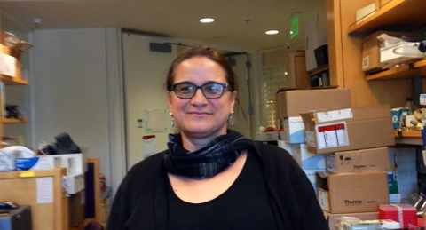

jenny.banaszek@ucsf.edu

 

**Education:**

Bachelor of the Arts in English and American Literature, University of California, San Diego. 

Master of the Arts in English and American Literature, San Francisco State University. 

 
Jenny Banaszek has been with the Yamamoto Lab since 2007. She is special assistant to Keith Yamamoto in all of his roles at UCSF and manages the UCSF Program for Breakthrough Biomedical Research (http://pbbr.ucsf.edu). All calendar items and requests for letters should go directly through Jenny.