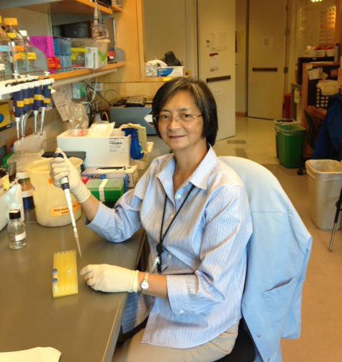

teresita.bernal@ucsf.edu

 
Teresita manages the day-to-day operations in the Yamamoto lab. In addition, she assists scientists with their research projects.  She is the liaison between the department safety advisor and the lab; and, collaborates with Dr. Yamamoto and lab members to ensure compliance with institutional and governmental  EH&S mandates.

**Education**

Bachelor of Science in Medical Technology

St. Louis University

Baguio City, Philippines

**Work experience**

Current:

Staff Research Associate/Lab Manager

University of California, San Francisco

**Past:**

Staff Research Associate

University of California, Berkeley

 

Research Assistant

Harvard University

Boston, Massachusetts

 

Medical Technologist

German Red Cross, Blood Bank

Rotenburg  (Wuemme), Germany

 

Medical Technologist

St. Louis University, Mobile Nursing Clinic

Baguio City, Philippines

**Selected publications**

Ward, J.D., Mullaney, B., Schiller, B.J., He le, D., Petnic, S.E., Couillault, C., Pujol, N., Bernal, T.U., Van Gilst, M.R., Ashrafi, K., Ewbank, J.J., Yamamoto, K.R. (2014). Defects in the C. elegans acyl-CoA synthase, acs-3, and nuclear hormone receptor, nhr-25, cause sensitivity to distinct, but overlapping stresses. PLoS One. 20, e92552. 

 

Ward, J.D., Bojanala, N., Bernal, T., Ashrafi, A., Asahina, M. and Yamamoto, K.R. (2013) Sumoylated NHR-25/NR5A regulates cell fate during C. elegans vulval development. PLoS Genet. 9, e1003992.

 

So, A.L., Bernal, T.U., Pillsbury, M.L., Yamamoto, K.R., Feldman, B.J. (2009) Glucocorticoid Regulation of the Circadian Clock Modulates Glucose Homeostasis. Proc. Natl. Acad. Sci. U S A. 106, 17582-7.

 

Zou, H., McGarry, T.J., Bernal, T., and Kirschner, M.W.  (1999)  Identification of a Vertebrate Sister-Chromatid Separation Inhibitor Involved in Transformation and Tumorigenesis.  Science 285: 418-422.