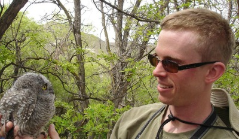

kirk.ehmsen@ucsf.edu

One unifying aspect of biology is variation – in nearly every phenotype we can name.  I’m interested in the sources of variation, its distribution in populations and its phenotypic consequences, and in the mechanisms by which genetic variation is converted to phenotype.  In metazoans like ourselves, one genome can be converted to several hundred cell types with overlapping yet unique properties.  Following a theme of major interest in the Yamamoto lab, I’m studying how common genes in different cell types can respond to an identical signal in different ways – in effect, converting a common signal (cortisol signaling) to variation in transcription that is reproducible within one cell type, but quite different between cell types.  We are using genome engineering (TALEN mutagenesis) and ultimately proteomics to better understand how different cell types are set up to generate transcriptional diversity downstream of a common signal. 

**Education:**

PhD, Biochemistry and Molecular Biology – UC Davis (2008)

 
BS, Biological Sciences (emphasis Molecular Biology, minor Avian Sciences) – UC Davis (2001) 