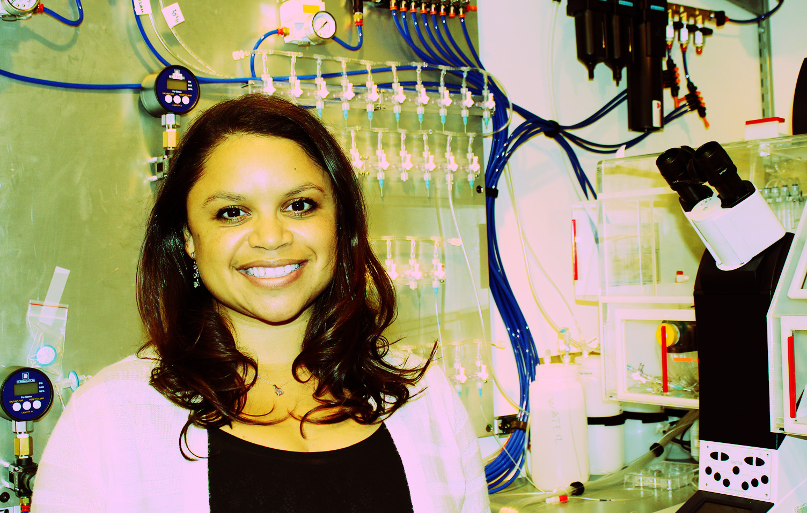

	Gabriela.Monsalve@ucsf.edu

Glucocorticoids (GCs) are lipophilic hormones that regulate a range of essential physiologic processes in vertebrates. GCs bind to and activate the glucocorticoid receptor (GR), which modulates transcription of cell-specific target genes in virtually all cell types. The intracellular concentrations of GCs modulate the activity of GR, but mechanisms that affect hormone entry into cells have not been thoroughly investigated. To identify the factors underlying the mediated transport of GCs, I am using a combination of biochemistry, genetic and chemical screens in mammalian and nematode model systems. This work will define novel molecular pathways of steroid transport and establish a new layer of metazoan gene regulation.

*** 

**Education**

Doctor of Philosophy in Biological Chemistry; 2007-2013 

University of California, Los Angeles

Advisor: Professor Alison Frand

 

Bachelor of Science, cum laude, in Biochemistry; 2001-2005

University of Minnesota, Twin Cities

Advisor: Professor Anath Das

 

Staff Research Scientist; 2005-2007

University of California, San Diego

Advisor: Professor Nicholas Spitzer

***

**Fellowships and Awards **

2014-Current         Robert Black Fellow, Damon Runyon Cancer Research Foundation

2013-Current         University of California President's Postdoctoral Fellow

2009-2012             National Science Foundation Predoctoral Fellow

2008-2011             National Academy of Sciences, Ford Foundation Predoctoral Fellow

*** 

**Selected publications**

Chin RM, Fu X, Pai MY, Vergnes L, Hwang H, Deng G, Diep S, Lomenick B, Meli VS, Monsalve GC, Hu E, Whelan SA, Wang JX, Jung G, Solis GM, Fazlollahi F, Kaweeteerawat C, Quach A, Nili M, Krall AS, Godwin HA, Chang  HR, Faull KF, Guo F, Jiang M, Trauger SA, Saghatelian A, Braas D, Christofk HR, Clarke CF, Teitell MA, Petrascheck M, Reue K, Jung ME, Frand AR, Huang J. The metabolite α-ketoglutarate extends lifespan by inhibiting ATP synthase and TOR. Nature. 2014 May 14. doi: 10.1038/nature13264.

 

Monsalve GC and Frand AR. Towards a Unified Model of Developmental Timing: ‘A Molting Approach’. Worm. 2012 Oct 1;1(4):221-30. doi: 10.4161/worm.20874.

 

Gomez F, Monsalve GC, Tse V, Saiki R, Weng E, Lee L, Srinivasan C, Frand AR, and Clarke CF. Decreased intestinal coliform counts mediate enhanced lifespan and stress resistance in Caenorhabditis elegans fed respiratory deficient E. coli. BMC Microbiology. 2012, 12:300. doi: 10.1186/1471-2180-12-300.

 

Monsalve GC, Van Buskirk C, and Frand AR. LIN-42/PERIOD controls cyclical and developmental progression of C. elegans molts. Current Biology. 2011 Dec 20. 21(24):2033-45. doi: 10.1016/j.cub.2011.10.054.

 

Root CM, Velázquez-Ulloa NA, Monsalve GC, Minakova E, and Spitzer NC. Embryonically expressed GABA and glutamate drive electrical activity regulating neurotransmitter specification. Journal of Neuroscience. 2008 Apr 30; 28(18):4777-84. doi: 10.1523/JNEUROSCI.4873-07.2008.

***

**Hobbies and skills**

I love to dance salsa, read about string theory, hike in the redwoods, run, enjoy good whiskey, and play piano.

*** 

**Languages**

English and Spanish